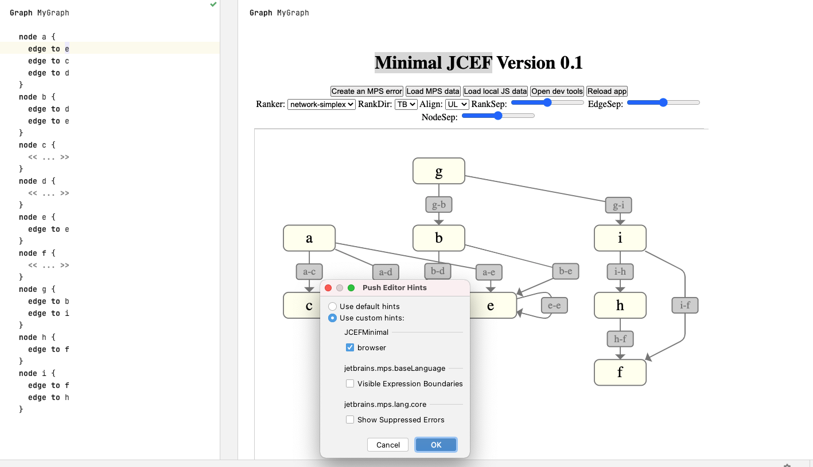

# Minimal JCEF example for MPS

## Features

- load a webapp using [JointJS](https://www.jointjs.com/) ([demo application](https://resources.jointjs.com/demos/directed-graph))
- two way communication between MPS and JS with a kind of message bus (similar to web sockets) + a solution with WebSockets (**NEW**)

## Requirements

- MPS 2021.1.4 with the pre-installed Jetbrains Runtime Environment

## Setup

`/solutions/WebApp/app` contains the web app. It uses ES6 and some external dependencies listed in `package.json`. Webpacks transpiles the project with the help of Babel to JS and creates a folder `dist` which contains the `index.html`and other resources that will be served by the browser.


To run the web app locally (not all button will work due do the communication with MPS):

```
yarn start
```

To build the app (necessary step):

```
yarn build
```

Then build the MPS project (it has no external dependencies).

## Workflow

To view the diagram, open the [MyGraph](http://127.0.0.1:63320/node?ref=r%3A5e97007c-fbfd-4391-a73e-647fb49fa2bc%28JCEFMinimal.sandbox%29%2F6666301319363610860) node and add the `browser` editor hint.
To make a change in the webapp, edit the app.mjs/index.html file (don't edit the dist folder directly!) and run `yarn build` and then click the `reload app` button :



Changes in the Graph can be send to the browser by pressing the `Load MPS data` button.

## JCEF JS communication vs WebSockets

Both communications methods are event based and work by sending and listening to events. The JCEF JS communication only works when the browser is embeded into MPS because it relies on JCEF.
The WebSockets communication works also with local running web applicaitons. The button `Send data via WebSocket` in the MPS editor can be used to send a message to all connected clients.
Make sure that the MPS project is opened first because the builtin netty server of the IntelliJ platform is used as the server. If the web application is started first (`yarn start`) it can't connect to the web socket server. The server is running on port 9000. In JS the connection can be established by calling `new WebSocket("ws://localhost:9000")` and calling the method `send` to send a message. The MPS and JS implementation for the JCEF communication and WebSocket communication in this project require that the message are serialized objects of the form `{ type: string, data: string}`.

## Open questions

- How to determine the needed size of the webbrowser? (currently determined by `document.documentElement.offsetWidth` and `document.documentElement.offsetHeight`).
- How would a fullscreen modus work like in the MPS diagram language?
- Should the scrolling be really dealed by the editor component or should be browser component has it's own scrollbar?
- Can the loading of the browser component improved? (flickering, example by using a loading indicator in JS)
- Is the browser component lifecycle correctly integrated in the MPS editor lifecycle and fully works with MPS class loading? What about the timing of the document ready event?
- Does the browser caching work correctly? (built by slisson)
- Why does browser component overlaps the MPS editor component's scrollbar?
    - guess by apann: The scroll pane doesn't support heavyweight Java components like the webbrowser ([source1](https://docs.oracle.com/en/java/javase/11/docs/api/java.desktop/javax/swing/JScrollPane.html#:~:text=Provides%20a%20scrollable,support%20heavyweight%20components.), [source2](https://docs.oracle.com/javase/8/docs/technotes/guides/troubleshoot/awt010.html))
    - guess by slisson: The browser doesn't respect the scrollbar when painting the component because the scrollbar is semi-transparent.
- Are there still any browser functionalities that should not work in MPS? (printing shortcut, right mouse click, shortcuts to navigate away from the browser)

## Additional ressources

[Java Chromium Embedded Framework | MPS Platform Docs](http://mbeddr.com/mps-platform-docs/mps_internal/jcef)
